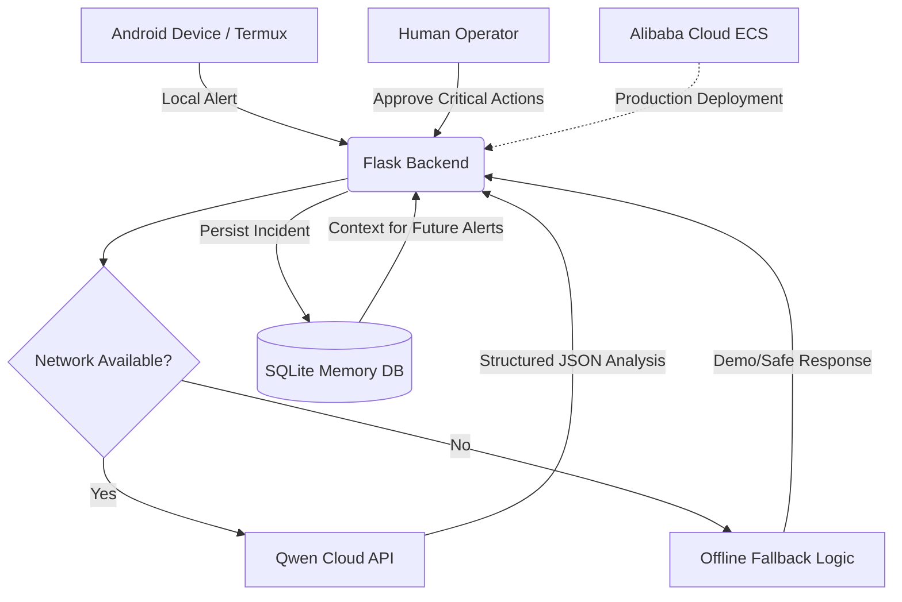

# 🛡️ Sentinel Edge
> Autonomous Cybersecurity Incident Response Agent for Mobile/Edge Devices

[](https://qwencloud-hackathon.devpost.com)
[](https://qwencloud-hackathon.devpost.com#tracks)
[](LICENSE)

**Sentinel Edge** is an offline-capable cybersecurity incident response agent that runs on Android/mobile devices via Termux. It perceives alerts locally, reasons with Qwen Cloud when connected, and acts with human-in-the-loop approval — delivering production-grade security automation even in constrained environments.

## 🎯 Hackathon Tracks
- ✅ **Track 5: EdgeAgent** (Primary) — Edge-cloud orchestration, offline fallback, privacy-aware design
- ✅ **Track 1: MemoryAgent** (Overlap) — Persistent SQLite memory for cross-session learning
- ✅ **Track 4: Autopilot Agent** (Overlap) — End-to-end IR workflow with approval checkpoints

## 🏗️ Architecture


## 🚀 Quick Start (Termux)
```bash
# 1. Install dependencies
pkg install python git nano curl
git clone https://github.com/macbere/sentinel-edge.git
cd sentinel-edge
python -m venv venv
source venv/bin/activate
pip install -r requirements.txt

# 2. Configure (add your Qwen API key when credits arrive)
echo "QWEN_API_KEY=your_key_here" > .env

# 3. Run locally
python app.py

# 4. Test endpoints
curl http://127.0.0.1:5000/health
curl -X POST http://127.0.0.1:5000/analyze \
  -H "Content-Type: application/json" \
  -d '{"alert": "Suspicious login from 10.0.0.5"}'
```

## ☁️ Alibaba Cloud Deployment (Coming Soon)
Once hackathon credits are activated:
```bash
# Deploy to Alibaba Cloud ECS (script coming in v1.1)
# See deploy/ directory for Terraform/CLI scripts
```

## 📊 API Endpoints
| Endpoint | Method | Description |
|----------|--------|-------------|
| `/health` | GET | Health check |
| `/analyze` | POST | Analyze alert (returns JSON analysis) |
| `/incidents` | GET | List recent incidents from memory |
| `/approve/<id>` | POST | Human approval checkpoint |

## 🧠 Key Features
- ✅ **Offline-First Design**: Graceful degradation when network unavailable
- ✅ **Persistent Memory**: SQLite stores incidents for cross-session learning
- ✅ **Structured Output**: Qwen returns strict JSON for reliable automation
- ✅ **Human-in-the-Loop**: Critical actions require explicit approval
- ✅ **Mobile-Optimized**: Runs entirely on Android via Termux

## 📦 Submission Assets
- [x] Public GitHub repo with MIT license
- [x] Architecture diagram (Mermaid + PNG)
- [ ] 3-minute demo video (coming)
- [ ] Alibaba Cloud deployment proof (coming)

## 👨‍💻 Built With
- Python 3.13 + Flask
- Qwen Cloud API (qwen-max)
- SQLite for edge persistence
- Termux for Android development

---
*Built for the Global AI Hackathon Series with Qwen Cloud • Track 5: EdgeAgent*
